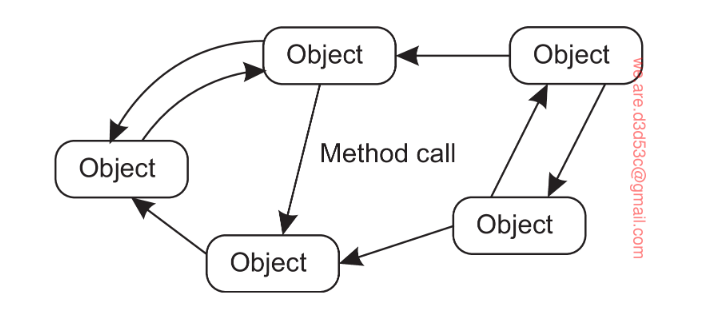

# Architecture of a Distributed System

- [Architecture of a Distributed System](#architecture-of-a-distributed-system)
  - [Architectural Styles](#architectural-styles)
    - [Layered Architecture](#layered-architecture)
    - [Service-oriented Architecture](#service-oriented-architecture)
      - [Object-based Architectural Style](#object-based-architectural-style)

## Architectural Styles

- The organization of distributed systems is mostly about the software components that constitute the system. 
- These software architectures tell us how the various software components are supposed to be organized and how they should interact. 
- An important goal of distributed systems is to separate applications from underlying platforms by providing a so-called middleware layer. The main purpose of doing so is to provide distribution transparency which is not simple to achieve and there is an inherent trade-off. 
- The actual realization of a distributed system requires that we instantiate and place software components on real machines.
- The logical organization of a distributed system is also termed as its software architecture.
- An architectural style is formulated in terms of components, the way that components are connected to each other, the data exchanged between components, and finally how these elements are jointly configured into a system. 
- A component is a software unit that encapsulates certain functionality and whose interfaces conform to a prescribed protocol. These **well designed** interfaces allow components to be replaceable in times of an upgrade or a failure.
- Special measures may need to be taken when a part of the distributed system does need to be restarted to let the updates take effect. Such measures may include having replicated standbys
that take over while the partial restart is taking place.
- The most important architectural styles for a distributed system are as follows:
  - Layered Architecture
  - Service-oriented Architecture
  - Publish-subscribe Architecture

Now, let us look at each of these architectural styles in detail.

### Layered Architecture

- The basic idea of such an architecture is to organize the system into layers, where each layer provides a set of services to the layer above it.
- The components are organized in a way that the layer above uses the services of the layer below. In other words layer $L_{A}$ can make a **downcall** to layer $L_{B}$. In some cases, the layer $L_{B}$ may also be able to make an **upcall** to layer $L_{A}$.
- Since making an upcall is an exception, I'd like to provide an example. When an operating system signals the occurrence of an event, to which end it calls a user-defined operation for which an application had previously passed a reference (typically refered to as a **handle**).
  
**Layered Communication Protocols**

- This section provides only a global picture of how the **communication-protocol stacks work** since a detailed discussion will be in the upcoming chapters. 
- Each layer in a layered architecture offers an interface with well-defined functions that can be called. 
- Another important concept to consider when studying communication are the **communication protocols** which describe the rules that govern the communication between two entities.
- It is important to understand the difference between a service offered by a layer, the interface by which that service is made available, and the protocol that a layer implements
to establish communication. 
- To make this *distinction* clear, consider a connection-oriented service where a connection is established between two entities before they can exchange data. Such a service ensures strong reliability guarantees meaning that the data will be delivered in the order in which it was sent. An example is the **TCP** or the **Transmission Control Protocol**.
- TCP specifies which messages are to be exchanged for establishing a connection, how to send data, and how to close a connection.
- There are different implementations of the interfaces available depending on the Operating System and the programming language being used. 

To further make this distinction clear, let us consider the following example of a simple client-server architecture involving two parties that can send and recieve data. Please note that some code has been removed for clarity.

**A simple server**

```python
from socket import *

s = socket(AF_INET, SOCK_STREAM) # create a socket
(conn, addr) = s.accept() # accept a connection
while True: # forever
    data = conn.recv(1024) # receive data
    if not data: break # until end of data
    msg = data.decode()+"*" # process data
    conn.send(msg.encode()) # send data
conn.close() # close connection
```

**A simple client**

```python
from socket import * 

s = socket(AF_INET, SOCK_STREAM) # create a socket 
s.connect((HOST, PORT)) # connecting to the server
msg = "Hello" # message to the server
s.send(msg.encode()) # encode and send the message
data = s.recv(1024) # receive data from the server
print(data.decode()) # print the data
s.close() # close connection
```

**Application Layering**

Now, we will shift our focus to the logical organization of applications. Applications can be constructed from roughly three pieces:
- Handle interaction with the user $\rightarrow$ The application-interface level
- A part that operates or interacts with the database. $\rightarrow$ The processing level
- A middle part that consists of the core functionality of the application. $\rightarrow$ The data level

Out of the three layers listed above, the processing layer is the most important one. It is the layer that is responsible for a majority of compute-intensive tasks. Why? Take the example of a house-ranking application. The application-interface layer is responsible for taking the input from the user and displaying the results. The data layer is responsible for storing the data in a huge database. The processing layer is responsible for computing the ranking of the houses.

**Drawbacks of Layered Architecture**

Although the layered architecure is very popular, it has some drawbacks. The main drawback is that it is not very flexible. The reason is that the layers are tightly coupled. This means that a change in one layer may require changes in other layers as well. This is not desirable. Applications that have been designed as compositions of existing components without much thought about strengthening the interface between the components are particularly vulnerable to this problem. Such direct dependencies has motivated the development of the **service-oriented architecture** comprising of loosely coupled components that are independent of each other and provide their functionality (so-called *services*) through well-defined interfaces.

### Service-oriented Architecture

- The basic idea of a service-oriented architecture is to organize the system into services, where each service provides a set of operations to the outside world. 
- These services are executed as separate processes (threads) and communicate with each other by exchanging messages. One type of a service-oriented arhicture is the **object-based architectural style** where the services are implemented as objects. We'll be using this to demonstrate the concept of a service-oriented architecture.

#### Object-based Architectural Style

- In essence, each object corresponds to what we have defined as a component, and these components are connected through a *procedure-call mechanism*.
- In case of a distributed infrastructure, these objects may be called over the network where the calling object need not be executed on the same machine as the called object. Even the location of this object might be hidden from the calling object. This is called **location transparency**.

Following is a diagram that shows the object-based architectural style.



